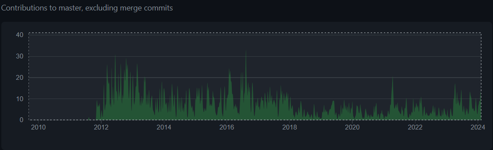
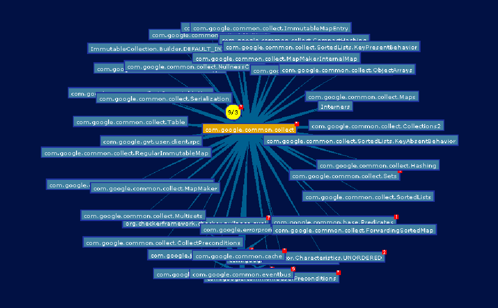
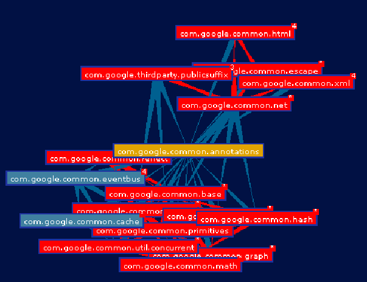

# 1. Présentation globale du projet
## 1.1 Utilité du projet 
### -<span id="test" style="color:cyan">  Utilité et fonctionnalité</span> 
Google Guava est une bibliothèque open-source développée par Google pour Java. Elle étend les fonctionnalités de la bibliothèque standard Java, fournissant des utilitaires pour les collections, la programmation fonctionnelle, la manipulation de chaînes, la gestion des événements, la concurrence, et d'autres fonctionnalités. Guava vise à rendre le développement Java plus efficace en offrant des classes et des utilitaires prêts à l'emploi pour des tâches courantes.  

### -<span id="test" style="color:cyan">  Comment l'utiliser?  </span> 
Pour l'utiliser avec Maven, il faut ajouter la dépendance Guava comme suit :  
```xml
<dependency>
  <groupId>com.google.guava</groupId>
  <artifactId>guava</artifactId>
  <version>33.0.0-jre</version>
  <!-- or, for Android: -->
  <version>33.0.0-android</version>
</dependency>
```  
Pour l'utiliser avec Gradle, il faut ajouter la dépendance comme suit: 
```gradle
dependencies {
  // Pick one:

  // 1. Use Guava in your implementation only:
  implementation("com.google.guava:guava:33.0.0-jre")

  // 2. Use Guava types in your public API:
  api("com.google.guava:guava:33.0.0-jre")

  // 3. Android - Use Guava in your implementation only:
  implementation("com.google.guava:guava:33.0.0-android")

  // 4. Android - Use Guava types in your public API:
  api("com.google.guava:guava:33.0.0-android")
}
```  

## 1.2 Description du projet
### -<span id="test" style="color:cyan"> Readme dans le projet</span>   
Le readme est pertinent, il contient beaucoup de liens vers des aides externes, contient aussi le guide d'installation et enfin les avertissements importants sur l'utilisation de Guava.
Cela fait environ 1 mois que le Readme n'a pas été modifié mais la plupart des modifications effectuées durant ce mois ont été des modifications sur des tests ou sur des suppresion warnings et donc il n'y a pas eu besoin de changer le README.

### - <span id="test" style="color:cyan">Documentation du projet  
Ce projet est bien fourni avec une documentation. Comme il s'agit d'une librairie, la documentation montre les instructions à suivre pour ajouter la dépendance.

### - <span id="test" style="color:cyan">Complétude de la documentation  </span> 
Les informations paraissent suffisante pour se servir de la librairie. Cependant la documentation a été mis à jour pour la dernière fois en 2016, donc il se peut que  certaines informations sont absentes  

# 2. Historique du logiciel  
## 2.1 Analyse du git
### -<span id="test" style="color:cyan"> Composition de l'équipe </span>    
Il y a 299 contributeurs. Chaque membre ne contribue de manière équilibrée. Ce n'est pas non plus équilibré dans le temps car certain contributeurs ont contribué en 2017 et ne sont plus revenu on revienne des années plus tard.  

### -<span id="test" style="color:cyan"> Acitivité du projet  </span> 
Le projet est toujours en activité. Elle est assez répartie sur le temps.  
Voici un diagramme illustrant l'activité en fonction du temps le nombre de commits par jour :  
  

### - <span id="test" style="color:cyan">Utilisation des branches </span>  
Il ya 28 branches au total, dont seulement 5 sont actives en comptant master.  

### -<span id="test" style="color:cyan"> Utilisation des pull requests   </span> 
Le mécanisme des pull requests est utilisé et il y en a 93 en attentes.  

# 3. Architecture logicielle  
## 3.1 Utilisation de bibliothèque extérieures  
### - <span id="test" style="color:cyan">Nombre de bibliothèques extérieures utilisées   </span> 
Nombre de bibliothèques extérieures : 7 maven dependencies 

## -<span id="test" style="color:cyan">Utilisation des bibliothèques extérieures  </span> 
Elles sont toutes utilisées 

## - 


## 3.2 Organisation en paquetages  
### -  <span id="test" style="color:cyan">Nombre de paquetages  </span> 
Il y a 18 paquetages.  

### - <span id="test" style="color:cyan"> Liens entre les paquetages </span>  
Par le métrique Efferent Coupling, on a trouvé que le paquetage **com.google.common.collect** importe un total de 222 autre paquetages. Voici un graphe illustrant cela :  

  

Par le métrique Afferent Coupling, on a trouvé que le paquetage **com.google.common.annotations** a été importé à un total de 1105 fois dans d'autre paquetages. Voici un graphe illustrant cela :  

  

### - <span id="test" style="color:cyan">Hiérarchie des paquetages</span>   
Le nombre de niveau des paquetages est 5.(Exemple : **com.google.common.base.internal**)  
La hiérarchie des paquetages des tests est similaire à la hiérarchie des paquetages des sources.
Il y a 3 paquetages vide servant à la hiérarchie des paquetages : com, google, common.  

### - <span id="test" style="color:cyan">Nom des paquetages  </span> 
Les noms des paquetages ne montrent pas explicitement les designs patterns utilisés.  
Il n'y a pas de lien avec une bases de données.  
Les noms des paquetages nous apprennent le sujet implémenter dans ces paquetages.  


## 3.3 Répartition des classes dans les paquetages  
### - <span id="test" style="color:cyan">Stats sur les paquetages </span> 
Le nombre maximum de classes dans un paquetage est 660.  
Le nombre moyen de classes dans un paquetage est 88.4.  
Le nombre minimum de classes dans un paquetage est 1 (ne comptant pas les paquetages vides mentionnés dessus).  
Le nombre total de classe est 1592.  

### - <span id="test" style="color:cyan">Encore des stats sur les paquetages </span>
La moitié des classes sont dans le paquetages com.google.common.collect, et le reste sont réparti dans les autres paquetages.  
Les paquetages non feuilles (com, google, common) ne contiennent pas de classes.  
Les sources et les tests ont les mêmes paquetages mais ne contiennent pas forcément le même nombre de classes.  

### - <span id="test" style="color:cyan">Couplages et cohésion  </span>
Par le métrique Afferent Coupling, on a trouvé que le paquetage **com.google.common.annotations** a été importé à un total de 1105 fois dans d'autre paquetages.  
Par le métrique Efferent Coupling, on a trouvé que le paquetage **com.google.common.collect** importe un total de 222 autre paquetages.  
Le paquetages **com.google.common.base** contient des classes qui importent d'autres classes de ce même paquetage.  
## 3.4 Organisations des classes  
### - <span id="test" style="color:cyan">Hiérarchie des classes  </span>  
Il y a 1,4 enfants par classes en moyenne. Le minimum étant 0 et le maximum 51.  
La moyenne de Depth of Inheritance Tree est de 1,67. Le minimum étant 0 et le maximum 4.  
Elle est plate.  

### - <span id="test" style="color:cyan">Stabilité des classes </span>  
La stabilité des classes en générale est de 53.7 %.  

### - <span id="test" style="color:cyan">Cohésion des classes </span> 
Les classes du paquetage **com.google.common.base** ont en moyenne
94 % de cohésion entre elles.  

# 4. Analyse appronfondie  
## 4.1 Test
### <span id="test" style="color:cyan">Stats sur les tests</span> 
Il y a 1770 classes tests.  
Il y a 11997 méthodes de tests.  
Il y a 74 055 assert au total.  

### - <span id="test" style="color:cyan">Couverture des tests </span> 
Le pourcentage de code couvert pas les tests est de 92,3 %.  
Il y a des parties du codes qui sont pas couverts comme par exemple la méthode **getInheritableThreadLocalsField()** dans **Finalizer.java** dans le package **com.google.common.base.internal** etc ...
En tout sur 183900 instructions, 14121 seulement ne sont pas couverts.

### - <span id="test" style="color:cyan">Type de tests </span> 
Il y a majoritairement des tests unitaires, mais il y a d'autres tests comme les tests fonctionnels, les tests de régressions, les tests de performances.

### - 
Il y a 7 tests qui ne sont pas passés sur 857236 tests.  

## 4.2 Commentaires  
### <span id="test" style="color:cyan">Nombre de commentaires</span> 
Il y a 1853809 lignes de commentaires.

### - 
On y trouve du javadoc, et aussi du code commenté dans les méthodes complexes et les méthodes nécessitant une clarification. 
Il y a aussi une licence à chaque debut des fichiers(copyright).  

### -  
Les méthodes simples comme les getters et les setters sont dépourvues de commentaires.  
Une partie des petites classes ne possèdent pas de commentaires à toutes les méthodes.(Exemple : **MacHashFunction.java** du paquetage **com.google.common.hash**).  
Une manière d'améliorere le code serait d'ajouter des commentaires à toutes les fonctions ayant besoin de plus d'explication.   

## 4.3 Dépréciation  
### <span id="test" style="color:cyan">Bout de code dépréciés</span>  
Voici quelques méthodes dépréciées:  
- la méthode digit() dans CharMatcher  
- la méthode javaDigit() dans Charmatcher  

Il y a des methodes dépréciées dans la majorité des paquetages.Celui qui en contient le plus est le paquetages **com.google.common.collect**  

Voici un exemple d'une méthode non dépréciée qui appelle une méthode dépréciée :  
- la méthode **com.google.common.jimfs.UserDefinedAttributeProvider.View.delete(String)** utilise la méthode **com.google.common.jimfs.File.deleteAttribute(String, String)**  qui lui utilise la méthode dépréciée **com.google.common.collect.ArrayTable.remove(Object, Object)**  

Donc cela provoque une propagation de la dépréciation ce qui signifie que si, un jour, la méthode dépréciée se voit supprimée alors toutes les méthodes appelant cette dernière ne marcheront plus.  


## 4.5 God classes  
Le maximum se trouve dans **LocalCache.java** avec 62 méthodes.  
Le minimum se trouve dans **ParametricNullness.java** avec 0 méthodes. 
La moyenne est de 6 méthodes par classes.  

Les gods classes qu'on a reperé sont : 
Map.java : fait référence a de nombreuses autres classes,
 LocalCache.java : elle utilisent plus de choses internes.  
Une amélioration possible serait de séparer la classe en plusieurs, pour éviter qu'une classe soit surchargée.


## 4.6 Analyses des méthodes  
Le maximum en compléxité cyclomatique est détenu par la méthode roundToDouble qui se trouve dans le fichier **ToDoubleRounder.java**  
Le minimum est à zero pour ParametricNullness.  
La moyenne est à 1,5.  

Le maximum de lignes de codes d'une méthode est de 107 dans le fichier **AbstractCompositeHashFunction.java**  
Le minimum est de 0 dans le fichier **LongAddable.java**  
La moyenne est de 5,8

Le maximum d'arguments dans une méthode est de 20 dans la méthode **of** de la classe **ImmutableMap** du fichier **ImmutableMap.java**  
**ImmutableBiMap** et **ImmutableSortedMap** possèdent toutes les deux une méthodes avec 20 arguments aussi.


Un exemple de méthode qui retourne un code d'erreur : 
- startFinalizer de **Finalizer.java** qui retourne un IllegalArgumentException  
- get de **Absent.java** qui retourne un  IllegalStateException  


# 5. Nettoyage de Code et Code Smells  
## 5.1 Règle de nommage  
Les noms choisies pour les méthodes sont bien indicatifs de leur fonctions.  
Les noms utilisés sont tous bien distingués et ne participent pas à la désinformation.Les noms sont parfois compliqués et long ,mais précis. Exemple : ImmutableMap, ImmutableEnumMap, LinkedHashMap,  HashMap...  
On a par exemple dans le fichier Map.java une méthode difference() qui retourne la différence entre les éléments de deux LinkedHashMap. Dans cette méthode on trouve des variables onlyOnLeft, onlyOnRigth, onBoth dont le rôle est très explicites.  

## 5.2 Nombre magiques  
Voici des exemples de nombres magiques :  
```java
 if (alphaIndex < 26 && alphaIndex == getAlphaIndex(c2)) {
        continue;
      }
```
Ici 26 est un nombre magique , bien qu'on reconnaisse assez vite que ca correspond au nombre de lettre de l'alphabet, ça aurait été plus clair de définir une variable avec un nom indicatif ex: alphabetLength.  


```java
int len = string.length();
StringBuilder buf = new StringBuilder((len * 3 / 2) + 16);
```
Ici le calcul se trouvant en paramètre de StringBuilder n'est pas du tout explicite et rien n'est indiqué dans la documentation de la méthode.  
    
## 5.3 Structure de code   

Le code est bien structuré , les variables d'instances sont régroupés au début de la classe. Les méthodes publiques sont bien en haut avant les méthodes privées.  


## 5.4 Code mort  
Un exemple de code mort :
- la fonction appendTo(A, Object, Object, Object...) dans **com.google.common.base** dans le fichier Joiner.java. Elle est implémentée mais n'est utilisé autre part dans tout le projet. C'est une des définition de la fonction donc elle peut être utile dans certain cas, de ce fait c'est convenable de ne pas la supprimer.  

- la fonction writeObject(ObjectOutputStream) dans **com.google.common.cache** dans le fichier LongAdder.java. Elle est implémentée mais n'est utilisé autre part dans tout le projet. Ceci pourrait être supprimé sans changer le comportement du code.  

Ne sachant si il s'agit d'une API public ou privé nous ne savons pas si nous pouvons retirer ces méthodes, cependant nous pouvons ajouter du code qui teste ces méthodes.


